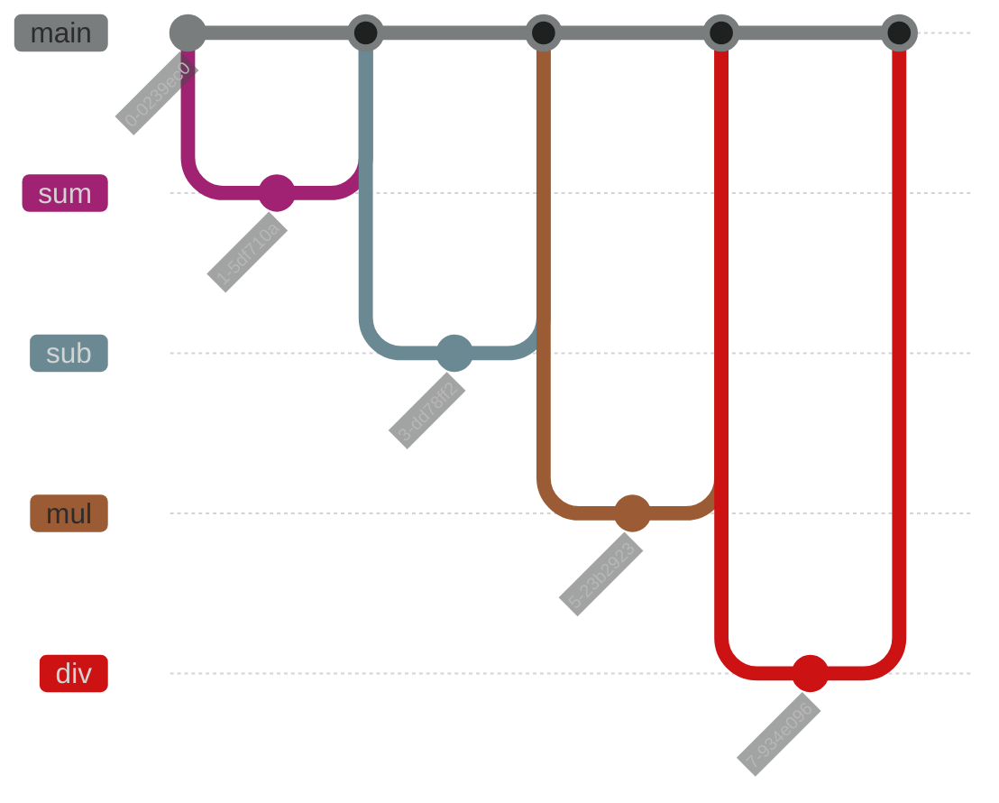

<!--
SPDX-FileCopyrightText: 2022 Michael Lodi <michael.lodi@unibo.it>
SPDX-FileCopyrightText: 2022 Daniele Tentoni <daniele.tentoni2@studio.unibo.it>

SPDX-License-Identifier: CC0-1.0
-->

---
title: Lezione Tool Git
author: Daniele Tentoni
date: 17/05/2022
---

Esame di Didattica dell'Informatica, A.A. 2021/2022

<!--
# Changelog (se necessario)

Se questa relazione è stata già consegnata in precedenza, indicare qui

* i cambiamenti più sificativi
* dove trovare un eventuale diff (se ritenuto necessario)
* risposte a eventuali domande/commenti fatti dai docenti sulle versioni precedenti
-->

# Inquadramento del lavoro

## Livello di scuola, classe/i, indirizzo

<!--
A chi è rivolta questa attività?

In quale specifica disciplina scolastica (o le discipline, ovviamente
l'informatica deve essere la disciplina prevalente) si colloca
l'attività?

- Per la scuola dell'infanzia / primaria / scuole \"medie\" si può fare riferimento a una delle discipline nelle Indicazioni Nazionali, nei Nuovi Scenari, e/o alla disciplina Informatica dalla Proposta CINI
- Per le scuole secondarie di secondo grado (superiori), fare riferimento ai documenti ministeriali e/o alla Proposta CINI.

Può essere---adattata---rivolta a studenti di diverse età e indirizzi?
-->

<!-- TODO: Controllare i documenti ministeriali e/o alla Proposta CINI -->

L'attività è rivolta specialmente al triennio di un istituto tecnico con indirizzo informatico, da svolgere durante le ore di Informatica o discipline annesse (Sistemi e Reti o Gestione di Progetto).

In generale, potendo tramite Git tracciare qualunque prodotto in grado di essere memorizzato su supporto informatico, l'attività può essere riadattata per poter insegnare Git ad un qualunque pubblico di studenti delle scuole superiori a cui si vuole proporre uno strumento di memorizzazione o versionamento alternativo ai classici storage fisici (pennette usb, supporti ottici ...) o cloud (Onedrive, Google Drive ...).

## Motivazione e Finalità

<!--
Perché avete scelto di realizzare questa specifica attività

Una sua brevissima descrizione generale
-->

Ho scelto di realizzare questa attività per due principali motivi:

1. La proporrei principalmente a studenti che hanno scelto il mio stesso percorso di studi alle scuole superiori, dove mi piacerebbe andare ad insegnare e dove penso che questa attività possa servire maggiormente, preparando gli studenti ad utilizzare uno dei più diffusi tools per il versionamento del codice;
2. Avendo già avuto esperienza lavorativa ho notato che gli studenti usciti da tali percorsi di studi non sono preparati abbastanza per entrare con tranquillità e rapidità dentro al mondo del lavoro. Molti non possiedono le competenze da me ritenute minime per poter lavorare in modo collaborativo neanche a piccoli progetti software interni alla mia realtà aziendale attuale.

Per tali motivi, penso che proporre agli studenti quelle che secondo me sono le competenze minime da acquisire durante il proprio percorso scolastico in tema di Versioning Control Systems e sviluppo collaborativo alla scrittura del codice sia un esercizio utile in preparazione alle future lezioni a studenti delle scuole e neo assunti interni alla mia azienda.

## Innovatività

<!--
Perché questa proposta è innovativa? Cosa è già presente su questo tema nella ricerca in Didattica dell'Informatica o nelle risorse disponibili online?
-->

Moltissime attività disponibili in rete che ho cercato non coprono gli stessi argomenti di questa. L'insieme delle competenze che vengono proposte nel seguente materiale è la scrematura di tutte quelle che io abbia mai usato nel mio ambito lavorativo fino adesso (al 2022 è il 5 anno di lavoro in un'azienda software cesenate di una ventina di dipendenti) e che penso siano assolutamente irrinunciabili per una persona neo-diplomata che voglia affacciarsi sul mondo del lavoro in ambito informatico.

Alcune delle risorse disponibili online attualmente sono:

- [https://git-scm.com/book/en/v2](https://git-scm.com/book/en/v2)
: Ebook scaricabile dal sito ufficiale del progetto Git. Moltissimi argomenti vengono trattati, potrebbe far desistere chi invece cerca un approccio più pragmatico. Include anche un capitolo sullo strumento Github, esattamente come questo materiale didattico. Quindi a mio parere è la scelta più valida possibile per chi volesse approfondire l'argomento autonomamente a casa;

- [https://learngitbranching.js.org/](https://learngitbranching.js.org/)
: Gioco gratuito per imparare nei primi livelli i comandi base e via via avanzando nel gioco concetti più complicati. Possibile allenamento in vista di interrogazioni e compiti in classe per gli studenti;

- [https://www.atlassian.com/git](https://www.atlassian.com/git)
: Guida a Git curata da Atlassian, uno dei principali attori in gioco in tema di Sistemi di Versionamento del Codice grazie alla loro piattaforma BitBucket. Propone guide ed esercizi per imparare ad usare gli strumenti Git e Bitbucket, similmente a https://lab.github.com/ per Githubò

- [https://www.atlassian.com/git/tutorials/atlassian-git-cheatsheet](https://www.atlassian.com/git/tutorials/atlassian-git-cheatsheet)
: Elenco dei principali comandi di Git curata dai sopracitati collaboratori di Atlassian.

## Prerequisiti

<!--
Elencare i contenuti che si suppone siano già stati svolti e appresi dagli studenti
-->

Gli studenti devono già essere in possesso delle seguenti competenze *minime*:

1. Manipolare files (creare, modificare, eliminare, spostare, copiare)
2. Navigare su siti internet (nello specifico github.com per il secondo modulo)

Le esercitazioni preparate per l'esame e fornite con questo materiale didattico, destinate a studenti di indirizzo informatico richiedono:

1. Sapere cosa sia un algoritmo, un programma, una funzione, una istruzione, un dato
2. Avere padronanza dei construtti semplici di un linguaggio a scelta del professore (in questo materiale didattico viene scelto il linguaggio Python)

Le seguenti conoscenze pregresse aiutano gli studenti a capire meglio gli argomenti trattati:

1. Sapere cosa sia un sistema operativo e come vengono memorizzati i files
2. Sapere cosa sia un'interfaccia a riga di comando, eseguire comandi e programmi, eseguire programmi con interfaccia grafica

Nel caso si ritenga superfluo o oneroso l'uso dell'interfaccia a riga di comando di git, possono essere valutati dei programmi ad interfaccia grafica come sostituti, come ad esempio:

* [Git Extensions](https://gitextensions.github.io/) (Linux, Windows, Mac)

* [Ungit](https://github.com/FredrikNoren/ungit) (Linux, Windows, Mac)

* [Github Desktop](https://desktop.github.com/) (Windows, Mac)

Git e i programmi sopra citati vengono tutti rilasciati con licenze aperte e libere.

## Contenuti

<!--
Spiegare brevemente i contenuti. Se si tratta di contenuti banalmente chiari per un informatico, elencarli semplicemente. Se ci sono contenuti particolari o specifici illustrarli brevemente.
-->

Si vuole introdurre gli studenti all'uso dello strumento Git per versionare il loro codice. Si vuole aiutare a comprendere loro il concetto di repository, branch, commit e staging area, visionare la storia dello stesso e le differenze tra i vari commit e l'attuale contenuto dei files nel repository con la loro controparte attualmente versionata dal repository.

## Traguardi e Obiettivi

<!--
Quali traguardi e obiettivi di apprendimento si vuole raggiungere con le attività proposte?
-->

Al termine delle lezioni nell'area `git` lo studente sa:
* distinguere tra sistemi di versionamento centralizzati o distruibuiti
* creare repository
* usare la staging area per gestire le modifiche, l'aggiunta e la rimozione di files
* registrare le modifiche nel repository tramite i commit, assegnare un messaggio utile per lo sviluppo del progetto
* creare un branch, identificare un branch principale, creare branch secondari e spostarsi tra di essi per portare avanti diversi sviluppi del progetto
* consultare la storia del repository essere consapevole di cosa significhi modificarla e come farlo consapevolmente per poter rimediare a degli errori
* gestire i conflitti delle modifiche quando si manifestano

Al termine delle lezioni nell'area `github` lo studente sa:
* distinguere i concetti di repository locale, remoto, versioning centralizzato e distribuito
* creare un repository remoto, collegarlo al suo repository in locale, eseguire download degli aggiornamenti dal repository remote e upload dal repository locale
* usare le issue come richiesta di chiarimenti, segnalazione di un problema o suggerimento di una soluzione
* usare le pull request come offerta di aggiunta di una nuova funzionalità e di una soluzione ad un problema riscontrato

Al termine di tutte le lezioni lo studente ha le competenze di gestire un progetto sofware al quale possano contribuire più persone, sia come spettatore (consultandolo soltanto), come utilizzatore (segnalando eventuali problemi), come contributore (sviluppando nuove funzionalità o correggendo quelle esistenti) e anche come manutentore (assegnando compiti ai contributori e in generale gestendo le relazioni con tutti gli attori del progetto).

Di seguito vengono schematizzati gli obiettivi seguendo le indicazioni della tassonomia Bloom rivisitata [^bloom].

| Dimensioni | Base | Intermedio | Avanzato |
| --- | --- | --- | --- |
| Repository locale | Lo studente sa creare il repository, committare dei file in esso. | Lo studente sa usare la staging area e scegliere quali file aggiungere. | Lo studente sa usare la staging area per aggiungere piccole modifiche tra le varie contenute dentro ad un certo file e le ha committate, scegliendo un adeguato commento per il commit. |
| Branches | Lo studente sa come visualizzare i rami presenti in locale | Lo studente sa creare in locale e come riunirli | Lo studente sa creare rami e gestire flussi più complessi, sa gestire git flow complessi e sa spiegare i vantaggi che essi comportano. |
| Storia e Tags | Lo studente sa visualizzare la storia del repository e i tag presenti. Sa annotare il commit corrente. | Lo studente sa navigare nella storia e annotare i commit passati. | Lo studente sa navigare nella storia e modificarla in modo proprio, sa annotare e assegnare un nome e un messaggio semanticamente ricco di significato ad un commit. |
| Github (contribuzione) | Lo studente sa sviluppare almeno una nuova funzionalità, usando correttamente i branch in locale e in remoto per *far arrivare* la feature sul branch principale su Github. | Lo studente sa aprire una pull request, chiedendo la correzione da parte di almeno un compagno. | Lo studente sa anche discutere con il compagno in merito alla soluzione proposta in modo costruttivo. |
| Github (lavoro in team) | Lo studente sa svolgere i compiti ad esso assegnati. | Lo studente riesce a coordinare il gruppo sapendo assegnare a se stesso/i e agli altri i compiti da svolgere e le funzionalità da sviluppare in modo equo. | Lo studente sa aiutare i compagni, sia tramite discussioni di persona in laboratorio che attraverso lo strumento Issues di Github. Lo/gli studente/i con la predisposizione a coordinare il gruppo sa valorizzare ogni componente. |

[^bloom]: [A Model of Learning Objectives](https://www.celt.iastate.edu/teaching/effective-teaching-practices/revised-blooms-taxonomy/)

### Collegamento con i documenti ministeriali/proposte

<!--
Indicare quali traguardi/obiettivi presenti nei documenti rilevanti vengono
raggiunti (es. Indicazioni nazionali per il primo ciclo, Nuovi scenari,
Proposta CINI numerata, Indicazioni nazionali / linee guida per scuola
secondaria di secondo grado).
-->

## Metodologie didattiche

<!--
Elencare brevemente quali metodologie didattiche si utilizzano.

Da quelle più classiche (es. lezione frontale, dialogata... uno schema [qui](https://www.leonardope.it/pvw/app/default/pvw_img.php?sede_codice=PELS0001&doc=2130858)) a quelle più moderne (unplugged, cooperative learning, pair programming, flipped classroom) discusse o viste a lezione.

Massima libertà di introdurre altre metodologie non spiegate a lezione (es. EAS) con i dovuti riferimenti.

Se si parla di didattica della programmazione, fare anche riferimento ai relativi concetti (macchina concettuale, misconcezioni, visualizzazione, program comprehension) spiegati a lezione.
-->

Vengono proposte due moduli che possono essere suddivisi in una o più lezioni frontali e due attività di laboratorio da proporre agli studenti che dovranno eseguire esercizi singolarmente e in gruppo.

Come metodologia principale si cerca di sfruttare la *Necessity Learning Design* [^NLD], dove il problema irrisolto è conservare in modo efficente ed efficace gli esercizi svolti dagli alunni (sia per l'insegnante che per gli alunni stessi) durante il corso della loro carriera, tenendo conto dei progressi compiuti e delle correzioni apportate, l'insegnamento è imparare ad usare lo strumento Git per salvare le modifiche ai loro artefatti e il "problema risolto" è effettuare le consegne dei futuri elaborati degli alunni tramite la piattaforma Github o un server Git interno alla rete d'istituto.

Nella prima lezione di teoria dei concetti base di Git si cerca di sfruttare una metodologia *unplugged*, spiegando gli hunk, i commit e i branch con l'ausilio di fogli di carta che vengono scritti, ritagliati, scotchati tra loro.

Nelle lezioni pratiche e di laboratorio verranno proposti degli *esercizi guidati* inizialmente, pensati per essere svolti, seguendo il *workflow* visto a lezione e ripreso nel testo dell'esercizio, abbondantemente al di sotto del tempo previsto per la lezione di laboratorio per permettere agli studenti di sperimentare autonomamente ed approfondire le prove svolte precedentemente.

In particolare, nell'area *github* gli studenti possono assumere diversi ruoli [^role_playing] a seconda di chi, alla fine di particolari esercizi, possiederà la proprietà del repository Github al quale tutti gli altri dovranno contribuire: il docente può creare diversi repository per ogni gruppo di studenti oppure saranno gli studenti stessi che dovranno creare i repository remoti su Github per poi usarli tra loro, concedendo i necessari diritti di accesso al docente. In queste lezioni, gli studenti saranno suddivisi in *Team di sviluppo* cercando di unire studenti con capacità complementari, senza mettere assieme tutti gli studenti migliori come in un dream team. Tenere conto anche della predisposizione degli studenti a coordinare, farsi coordinare o lavorare in solitaria.

[^NLD]: Necessity Learning Design approfondito nel seminario di Marco Sbaraglia dal titolo [Sentire la Necessity per imparare a programmare](https://docs.google.com/presentation/d/1tjFUfJzOOGkeQNdptizrudBbFXERYLDIyiLl5CRstgs/edit#slide=id.p1).

[^role_playing]: gli studenti si immedesimano in programmatori su un unico progetto software, Strategie Didattiche (A. Calvani) pag. 10

## Tempi

<!--
Un'idea generale e indicativa dei tempi richiesti
-->

In totale 2 lezioni frontali da un'ora ciascuna con gli studenti per introdurre gli aspetti teorici di ciascun modulo e 2 lezioni per applicare tali concetti nella pratica, eventualmente con l'ausilio di un laboratorio di due o tre ore ciascuno dove gli studenti possano eseguire gli esercizi e sperimentare autonomamente.

## Spazi

<!--
Classe, laboratorio, cortile...
-->

Le lezioni frontali possono essere svolte in qualunque aula. Gli argomenti teorici possono essere insegnati anche senza l'ausilio di un supporto informatico, in modalità unplugged. Durante le lezioni più pratiche dove gli studenti dovranno svolgere esercizi e laboratori, serve uno spazio dove poter usare il proprio personal computer o dispositivi messi a disposizione dalla scuola.

## Materiali e Strumenti

<!--
Quali materiali e strumenti (hardware e software, di ogni tipo, non solo informatico) sono necessari?
-->

Per la prima parte di spiegazione di concetti teorici sono necessari fogli di carta, forbici e scotch. Per la seconda parte più pratica sono necessari dei computer personali per ciascun studente per eseguire i comandi dello strumento Git. Essendo tale strumento disponibile per i più diffusi sistemi operativi.

Per la consegna degli esercizi di Git tramite Git basta l'accesso ad un server Git messo a disposizione all'interno del laboratorio, mentre per la parte di uso di Github serve necessariamente un collegamento ad internet (meglio se a banda larga, meglio specificare).

# Sviluppo dei contenuti

<!--
Questa deve essere la parte centrale e più corposa del documento.
Viene lasciata a voi massima libertà su come organizzarla.
Deve contenere almeno:
1. Materiale didattico per studenti
2. Guida per gli insegnanti
    * Consigli su come utilizzare il materiale didattico. E' possibile inframezzarli al materiale didattico per studenti (ma in tal caso chiarire bene cosa è per l'insegnante e cosa viene dato agli studenti)
    * Suggerimenti su come valutare il raggiungimento degli obiettivi di apprendimento da voi individuati (soprattutto valutazione formativa)
-->

## Introduzione al versionamento del codice

Al giorno d'oggi gli standard di qualita' dello sviluppo del codice impongono alle aziende e alle universita' di tenere sempre conto di chi lavora su quali progetti, su quali aree degli stessi, su quali singoli file per poter risalire ai proprietari in caso di attribuzione di proprieta' intellettuale sugli stessi, ricerca e risoluzione di problemi o quantificazione della retribuzione per l'eventuale lavoro svolto. In ambito scolastico, uno studente potrebbe avere la necessita' di ripristinare il proprio esercizio o elaborato ad uno stadio precedente dopo aver svolto una prova o aver continuato per una strada sbagliata e voler tornare indietro. Piu' in generale, chiunque vorrebbe poter aggiungere, modificare, eliminare o manipolare in qualunque modo un prodotto informatico da solo e poter seguire diversi sviluppi differenti oppure lavorare con un team di persone che hanno bisogno di manupolare lo stesso prodotto contemporaneamente senza incorrere perennemenete in problemi di aggiornamento della propria versione del prodotto. Una prima soluzione a tutti questi problemi potremmo averla usando solamente il nostro file system. Facciamo l'esempio del programmatore solitario:
1. Alla creazione del nuovo progetto, crea una cartella `Prog`
2. Aggiunge files alla cartella `Prog`, come un `main.py`, `dataset.txt` e altri
3. Vuole provare a sviluppare la funzionalita' di modifica del dataset in base a certi parametri, quindi crea la cartella `Prog_before_params` dove copia il contenuto attuale della cartella `Prog` come backup nel caso in cui dovesse tornare indietro e inizia a modificarne il contenuto
4. Il cliente gli chiede di iniziare anche a sviluppare una funzionalita' per leggere eventuali dataset in un formato differente, quindi crea una copia della cartella `Prog_before_params` e la rinomina in `Prog_nuovo_formato`

Si nota quindi come per cambiare di poche righe di codice un progetto in corso per ciascuna funzionalita' si devono creare diverse copie della cartella contenente il nostro progetto appunto. Volendo poi salvare lo stato del progetto durante le varie fasi della sua vita, creando un *backup* per la versione 1, uno per la versione 2 e altre per ogni versione prodotta, si capisce che la quantita' di file duplicati superi di gran lunga quella realmente necessaria, magari dobbiamo duplicare centinaia di file per delle modifiche a una manciata di files.

Per questo vengono in nostro aiuto il sistemi odierni di versionamento del codice. Nel corso del tempo sono state adottate varie tecniche e metodologie per gestire le versioni di un qualunque prodotto informatico, in particolare citiamo due diverse e contrapposte modalita':
* la centralizzata: un unico punto di verita' (da qui chiamato per semplicita' server) contiene tutto il nostro progetto e ogni persona che vuole contribuire ad esso deve chiedere il permesso di modificarne una parte (creare un nuovo file, modificarne uno esistente, eliminarne...) e una volta terminato, notifica al server di aver completato le modifiche e il server si occupa di salvare l'aggiornamento. Questa modalita' nel tempo e' stata sempre meno utilizzata in favore della successiva, dato che creava problemi quando piu' persone volevano modificare la stessa porzione del progetto oppure se la fonte centrale del progetto era inaccessibile, non era possibile lavorare.
* la distribuita: ogni sviluppatore possiede l'intera copia del progetto sul quale si sta lavorando e puo' in ogni momento lavorare su di esso. Quando sara' pronto a pubblicare le proprie implementazioni, allora lui stesso si assume il compito di chiedere agli altri contribuenti di scaricare le modifiche dalla propria versione del progetto o sara' lui ad inviarle agli altri.

Nel mio materiale didattico usero' la modalita' distribuita, ad oggi tra le piu' utilizzate in ambito scolastico, accademico e lavorativo. Vedremo nel dettaglio lo strumento **Git** per versionare un progetto in ambito locale, sulla propria macchina e gestirne le versioni e lo sviluppo di diverse funzionalita'. Vedremo lo strumento **Github** come gestore di progetti versionati salvati in una localita' remota che ci aiuta anche a gestire la contribuzioni agli stessi progetti dei nostri compagni e colleghi.

## Versionamento del codice (unplugged)

Dimostrazione della modalita' di versionamento del codice proposta da *Git* usando fogli di carta, forbici e scotch. Tutte le operazioni in seguito proposte potranno essere riviste in laboratorio tramite comandi Git scritti tra parentesi.

Prendere un foglio e scrivere sopra un programma Python che effettui la divisione di due numeri come nel codice seguente:

```python
"""
Make the division between two numbers.
"""

first = float(input("First param:"))

second = float(input("Second param:"))

result = first / second

print("The result is " + str(result))
```

Quando il codice e' stato scritto, si vuole salvare il lavoro svolto nel nostro sistema di versionamento del codice (`add` e `commit`). Scriviamo affianco di ogni riga il nostro nome e l'ora della modifica (per semplicita' vengono mostrate solamente le prime righe):

```python
"""                                         Daniele Tentoni (9:50)
Make the division between two numbers.      Daniele Tentoni (9:50)
"""                                         Daniele Tentoni (9:50)
```

A questo punto, simulare la modifica di tale codice aggiungendo il seguente codice per il controllo dell'input sul divisore:

```python
if second == 0:
    print("Second param cannot be 0")
    exit()
```

Scriviamo quindi il codice precedente su una striscia di carta.

Ritagliamo il foglio di carta principale nel punto indicato dalle freccie nel punto indicato di seguito:

```
second = float(input("Second param:"))

<-----------> Tagliare qui <------------>

result = first / second
```

Dato che essa sara' una parte aggiunta, attacchiamo con lo scotch le due parti del foglio principale con la striscia per l'aggiunta, in questo modo (un ulteriore `add`):

```
second = float(input("Second param:"))

<-----------> Scotch qui <------------>

if second == 0:
    print("Second param cannot be 0")
    exit()

<-----------> Scotch qui <------------>

result = first / second
```

A questo punto, scriviamo di lato il nome di chi ha apportato la modifica e l'ora in cui e' avvenuto (`commit` delle ultime modifiche effettuate), cosi':

```
...

if second == 0:                             Daniele Tentoni (9:55)
    print("Second param cannot be 0")       Daniele Tentoni (9:55)
    exit()                                  Daniele Tentoni (9:55)

...
```

Il risultato finale visibile sara' quindi il seguente (in laboratorio o con l'ausilio di un computer e `git` possiamo vedere lo stesso risultato usando `blame`):

```python
"""                                         Daniele Tentoni (9:50)
Make the division between two numbers.      Daniele Tentoni (9:50)
"""                                         Daniele Tentoni (9:50)

first = float(input("First param:"))        Daniele Tentoni (9:50)

second = float(input("Second param:"))      Daniele Tentoni (9:50)

if second == 0:                             Daniele Tentoni (9:55)
    print("Second param cannot be 0")       Daniele Tentoni (9:55)
    exit()                                  Daniele Tentoni (9:55)

result = first / second                     Daniele Tentoni (9:50)

print("The result is " + str(result))       Daniele Tentoni (9:50)
```

In questo modo abbiamo visto come creare una nuova risorsa, aggiungerla al sistema di controllo di versione, preparare una modifica ad essa ed applicarla. Gli studenti possono continuare a sperimentare con aggiunte e modifiche alla risorsa proposta.

### Tag (o etichetta)

Cosa sono:
* un hunk
    * aggiungere un hunk
    * rimuovere un hunk
    * (esercizio) aggiungere singoli hunk da vari files
* un commit
    * creare un commit
    * (avanzato, insegnare con cura) fare ammenda dei propri commit
* un branch
    * creare un branch
    * cambiare branch
    * mergiare branch
    * eliminare branch
* un tag (importante perche' creare un tag)
    * creare un tag, anche annotato
    * eliminare un tag
* avanzato: git flow e buone prassi

Dopo l'installazione bisogna configurare git usando i comandi:
```
git config --global user.name
git config --global user.email
```

# Bibliografia

<!--
Citare le fonti utilizzate (si consiglia ad esempio bibtex o biblatex)
-->

# Licenza del documento

Questo documento viene fornito con licenza Creative Commons 1.0 Universal, di cui una copia è disponibile [allegata](/LICENSES/CC0-1.0.txt) al repository dove è contenuto questo file.

<!--
Specificare la licenza del documento.

Sono caldeggiate licenze libere (es. [Creative Commons](https://creativecommons.org/licenses/by-sa/4.0/deed.it)), così da poter
condividere (es. pubblicazione sul Wiki) il documento con futuri
colleghi o insegnanti.

NB: non basta specificare una licenza, bisogna anche rispettarla (es. non includere testi o immagini con licenze non compatibili con quella scelta)
-->

## Final Result

Your repository story has to look like this:

Il comando `git init` inizializza il repository.

Il comando `git status` mostra lo stato attuale del repository.

Il comando `git log` mostra la storia attuale del repository.

Il comando `git add` aggiunge dati alla staging area.

Il comando `git commit` scrive le modifiche aggiunte alla staging area alla storia del repository.

I comandi `git push` e `git pull` servono solo per repository remoti.

Quindi a seguito dei comandi:
```
git init
echo "Esercizio" >> README
```
Lo stato del repository sara' il seguente:

```mermaid
sequenceDiagram
    Untracked
    Note over Untracked: README
```

Eseguendo il comando `git add`:

```mermaid
sequenceDiagram
    Untracked->Staged
    Note over Staged: README
```

Eseguendo il comando `git commit`

```mermaid
sequenceDiagram
    Untracked
    Staged
    History
    Note over History: README
```

Ora il file README sara' sempre marcato come tracked dal tool git, quindi, effettuando una modifica ad esso `echo "Daniele Tentoni" >> README` otteniamo il seguente stato:

```mermaid
sequenceDiagram
    Untracked
    Unmodified
    Modified
    Staged
    Note over Modified: README
```

E l'output del comando `git status` sara' il seguente:

```
$ git status

On branch main
Your branch is up-to-date with 'origin/main'.

Changes not staged for commit:
  (use "git add <file>..." to update what will be committed)
  (use "git restore <file>..." to discard changes in working directory)
        modified:   README.md

nothing added to commit but untracked files present (use "git add" to track)
```


